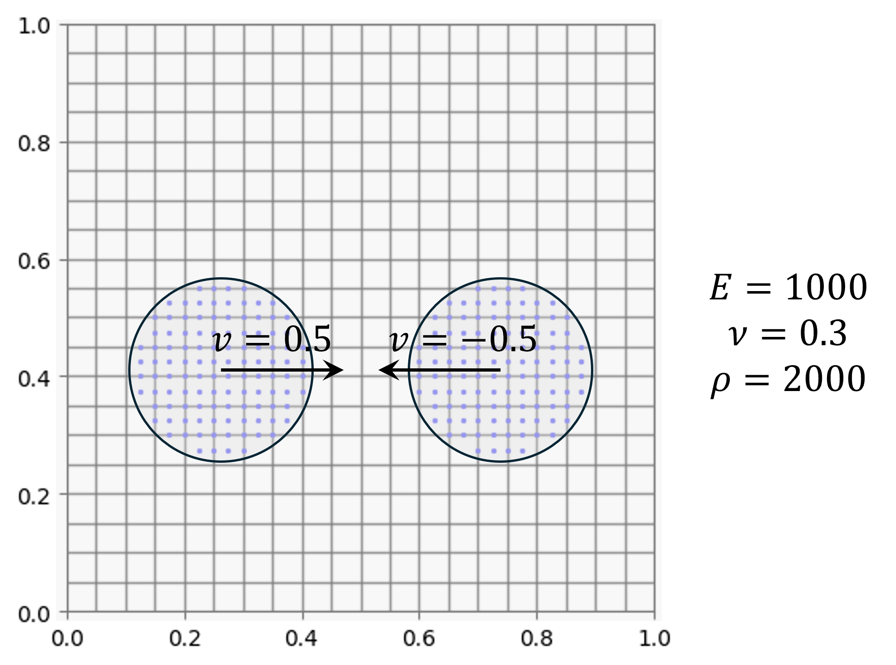

# Learn MPM 2D with Python
> Yongjin Choi

This repository provides hands-on practice for simple 2D material point method (MPM) code using Python jupyter notebook.




### Prerequisite
* This practice uses numpy library in python. 
* To review basic information of MPM, please refer to [this site](https://www.geoelements.org/LearnMPM/mpm.html). It introduces governing equations, discretisation, and time integration scheme in MPM, with hands-on python practice for 1D MPM.

### Install
```shell
# Initiate a python virtual environment.
python -m virtualenv venv
# Activate the virtual environment.
source venv/bin/activate
# Install dependencies.
python -m pip install --upgrade pip
pip install -r ./book/requirements.txt
```

# Inspiration
* https://github.com/geoelements/LearnMPM
* Nguyen, V. P., de Vaucorbeil, A., & Bordas, S. (2023). The material point method. Cham: Springer International Publishing.
* https://github.com/vinhphunguyen/mpmat?tab=readme-ov-file
